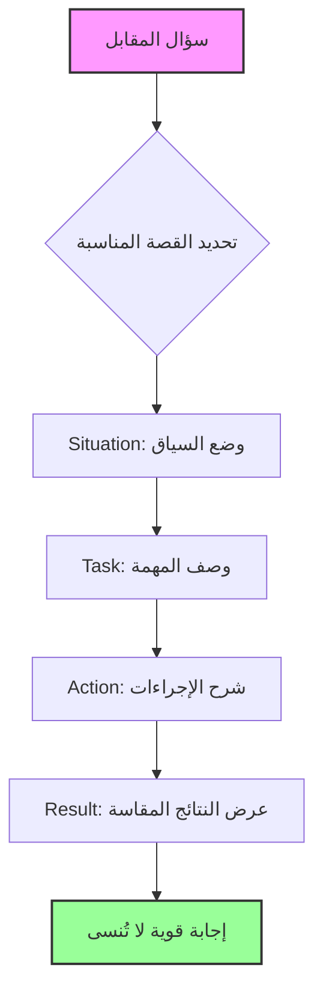

# أسرار مقابلات العمل الناجحة: دليلك التقني للتميز في 2026
## Secrets of Successful Job Interviews: Your Technical Guide to Excellence in 2026

إذا كنت تظن أن مقابلات العمل مجرد أسئلة عشوائية، فأنت تخسر نصف المعركة. الحقيقة أن كل مقابلة ناجحة تتبع نمطًا معماريًا واضحًا—تمامًا مثل كتابة كود جيد. في هذا المقال، سنفكك شفرة النجاح في المقابلات باستخدام أطر عمل مثبتة، أمثلة عملية، ورسوم بيانية توضيحية، استنادًا إلى أحدث الأبحاث والمصادر الموثوقة.

If you think job interviews are just random questions, you are losing half the battle. The truth is that every successful interview follows a clear architectural pattern—just like writing good code. In this article, we will decode interview success using proven frameworks, practical examples, and illustrative diagrams, based on the latest research and reliable sources.

لماذا يفشل معظم المرشحين؟ (حتى الأذكياء منهم) السبب ليس نقص المهارات التقنية. وفقًا لدراسة من Glassdoor، أكثر من 60% من المرشحين يفشلون بسبب ضعف التحضير للأسئلة السلوكية. بينما يركز الجميع على "كيف تحل مشكلة الخوارزمية"، يتجاهلون فن رواية القصة المنظمة. هنا يأتي دور طريقة STAR—التي تعتبرها Wikipedia المعيار الذهبي للإجابة على الأسئلة السلوكية.

Why do most candidates fail? (Even the smart ones) The reason is not a lack of technical skills. According to a Glassdoor study, over 60% of candidates fail due to poor preparation for behavioral questions. While everyone focuses on "how to solve the algorithm problem," they ignore the art of structured storytelling. This is where the STAR method comes in—which Wikipedia considers the gold standard for answering behavioral questions.

المشاكل الشائعة التي تقتلك:
*   **التحدث بدون هيكل:** إجاباتك تصبح كـ "كود spaghetti" غير قابل للقراءة.
*   **إهمال الأرقام:** قول "حسّنت الأداء" بدون أرقام هو مثل قول "الكود يعمل" بدون اختبارات.
*   **التجاهل التام للغة الجسد:** Harvard Business Review في فيديوها التحليلي تثبت أن المصافحة الضعيفة قد تدمر انطباعك الأول.

Common problems that kill your chances:
*   **Speaking without structure:** Your answers become like unreadable "spaghetti code."
*   **Neglecting numbers:** Saying "I improved performance" without numbers is like saying "the code works" without tests.
*   **Ignoring body language:** Harvard Business Review proves in its analytical video that a weak handshake can ruin your first impression.

### هيكل النجاح: طريقة STAR (Situation, Task, Action, Result)
### The Structure of Success: The STAR Method (Situation, Task, Action, Result)

هذه ليست مجرد تقنية—إنها الـ Architecture Pattern لمقابلتك. تخيلها كـ Design Pattern في البرمجة: نمط متكرر لحل مشكلة متكررة.

This is not just a technique—it is the Architecture Pattern for your interview. Think of it as a Design Pattern in programming: a recurring pattern for solving a recurring problem.

### مثال عملي: كيف تجيب على سؤال "حدثني عن وقت واجهت فيه تحديًا صعبًا"
### Practical Example: How to answer "Tell me about a time you faced a difficult challenge"

هذا هو النموذج القابل لإعادة الاستخدام (Reusable Template) الذي يمكنك تطبيقه على أي سؤال:

This is the Reusable Template that you can apply to any question:

*   **السؤال:** "حدثني عن وقت واجهت فيه تحديًا صعبًا في العمل."
*   **Situation:** "في وظيفتي السابقة كمدير مشروع في شركة X، كنا مكلفين بإطلاق ميزة برمجية جديدة خلال 3 أشهر فقط."
*   **Task:** "كانت مسؤوليتي تنسيق جهود فريق الهندسة والتسويق لضمان التسليم في الوقت المحدد، لكن في منتصف الطريق استقال أحد أعضاء الفريق الأساسيين بشكل مفاجئ."
*   **Action:** "أعدت فورًا ترتيب أولويات backlog المشروع مع قائد الفريق الهندسي، وتفاوضت على تمديد أسبوع واحد مع العميل، وتوليت شخصيًا بعض مهام التوثيق للعضو المغادر. كما طبقت اجتماعات يومية مدتها 15 دقيقة لتحسين التواصل."
*   **Result:** "سلمنا الميزة متأخرة 3 أيام فقط، وهو ما قدّره العميل. المنتج حقق إيرادات بقيمة 50,000 دولار في الربع الأول، وتحسنت كفاءة فريقي بنسبة 15% بفضل الاجتماعات اليومية الجديدة."

*   **Question:** "Tell me about a time you faced a difficult challenge at work."
*   **Situation:** "In my previous job as a project manager at Company X, we were tasked with launching a new software feature in just 3 months."
*   **Task:** "My responsibility was to coordinate the engineering and marketing teams to ensure on-time delivery, but halfway through, a key team member resigned unexpectedly."
*   **Action:** "I immediately reprioritized the project backlog with the engineering lead, negotiated a one-week extension with the client, and personally took over some documentation tasks for the departing member. I also implemented 15-minute daily stand-ups to improve communication."
*   **Result:** "We delivered the feature only 3 days late, which the client appreciated. The product generated $50,000 in revenue in the first quarter, and my team's efficiency improved by 15% thanks to the new daily meetings."

---

### أسلوب CAR: البديل الأسرع (Challenge, Action, Result)
### The CAR Method: The Faster Alternative (Challenge, Action, Result)

إذا كنت في مقابلة سريعة الوتيرة أو تحتاج إجابة مكثفة، استخدم CAR Framework. الفرق الوحيد: تدمج الـ Situation والـ Task في "Challenge" واحد.

If you are in a fast-paced interview or need a concise answer, use the CAR Framework. The only difference: you merge the Situation and Task into one "Challenge."

| العنصر | STAR | CAR |
| :--- | :--- | :--- |
| البداية | Situation + Task | Challenge |
| الوسط | Action | Action |
| النهاية | Result | Result |

| Element | STAR | CAR |
| :--- | :--- | :--- |
| Beginning | Situation + Task | Challenge |
| Middle | Action | Action |
| End | Result | Result |

---

### Key Takeaways
*   **استخدم STAR أو CAR كـ Design Pattern:** حول القصص الغامضة إلى روايات مقنعة بأرقام ملموسة.
*   **ابنِ "بنك قصص" (Story Bank):** جهز 6-8 قصص منظمة لتمنحك مرونة في التعامل مع أي سؤال.
*   **المقابلة طريق ذو اتجاهين:** حضّر أسئلة ذكية تظهر بحثك العميق واهتمامك الحقيقي.
*   **لا تهمل لغة الجسد:** 93% من التأثير غير لفظي—تدرب على المصافحة، العيون، ونبرة الصوت.
*   **التحضير هو السلاح السري:** ابحث عن الشركة، المقابل، والصناعة كما تبحث عن حل لمشكلة برمجية معقدة.

### Key Takeaways
*   **Use STAR or CAR as a Design Pattern:** Turn vague stories into compelling narratives with concrete numbers.
*   **Build a "Story Bank":** Prepare 6-8 structured stories to give you flexibility in handling any question.
*   **The interview is a two-way street:** Prepare smart questions that show your deep research and genuine interest.
*   **Don't neglect body language:** 93% of the impact is non-verbal—practice your handshake, eye contact, and tone of voice.
*   **Preparation is the secret weapon:** Research the company, the interviewer, and the industry just as you would research a solution to a complex coding problem.