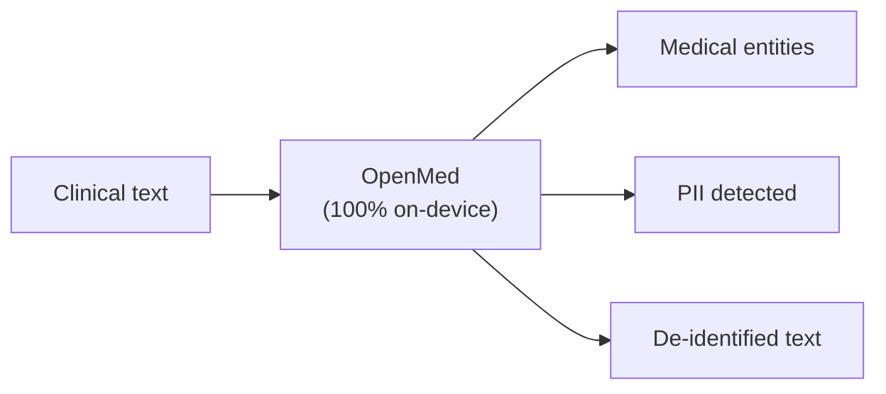

# maziyarpanahi / openmed

Local-first healthcare AI that never leaves the device. Turn clinical text into structured insight with one line of code. Entity extraction, PII de-identification, and 1,000+ specialized medical models that run entirely on your own hardware — from a one-liner in Python to a native Swift app on iPhone, powered by Apple MLX. No cloud. No vendor lock-in. No patient data leaving your network.
**本地优先的医疗 AI，数据永不出设备。** 只需一行代码，即可将临床文本转化为结构化洞察。包含实体提取、个人隐私信息（PII）去标识化，以及 1,000 多种完全运行在你自有硬件上的专业医疗模型——从 Python 的一行代码到 iPhone 上的原生 Swift 应用，均由 Apple MLX 提供支持。无云端依赖，无供应商锁定，患者数据绝不离开你的网络。

1,000+ models · 12 languages · 247 PII checkpoints · 100% on-device · Apache-2.0
1,000+ 模型 · 12 种语言 · 247 个 PII 检查点 · 100% 本地运行 · Apache-2.0 协议

English · 简体中文 · Español · Français · Deutsch · Italiano · Português · Nederlands · العربية · हिन्दी · తెలుగు · 日本語 · Türkçe · فارسی
英语 · 简体中文 · 西班牙语 · 法语 · 德语 · 意大利语 · 葡萄牙语 · 荷兰语 · 阿拉伯语 · 印地语 · 泰卢固语 · 日语 · 土耳其语 · 波斯语

### See it in action
### 实际演示

OpenMed runs entirely on the device — clinical text never leaves it. Here it is on iPhone, fully offline:
OpenMed 完全在设备上运行——临床文本绝不会离开设备。以下是它在 iPhone 上完全离线运行的效果：

On iPhone via OpenMedKit — scan a clinical note, de-identify it, and extract clinical signals, all locally with Apple MLX. Nothing is uploaded.
通过 OpenMedKit 在 iPhone 上运行——扫描临床笔记、进行去标识化并提取临床信号，所有操作均通过 Apple MLX 在本地完成。没有任何数据被上传。

Real-time PII de-identification — the Nemotron Privacy Filter redacting names, addresses, IDs, and billing data from a clinical discharge packet, entirely on-device. (All values shown are synthetic.)
实时 PII 去标识化——Nemotron 隐私过滤器从临床出院小结中遮盖姓名、地址、身份证号和账单数据，全程在设备端完成。（所展示的所有数值均为合成数据。）

### 30-second example
### 30 秒示例

```python
from openmed import analyze_text
result = analyze_text(
    "Patient started on imatinib for chronic myeloid leukemia.",
    model_name="disease_detection_superclinical",
)
for entity in result.entities:
    print(f"{entity.label:<12} {entity.text:<28} {entity.confidence:.2f}")
# DISEASE      chronic myeloid leukemia     0.98
# DRUG         imatinib                     0.95
```
A state-of-the-art clinical NER model running locally — no API key, no network call.
一个运行在本地的最先进临床命名实体识别（NER）模型——无需 API 密钥，无需网络调用。

### Why OpenMed?
### 为什么选择 OpenMed？

| Feature | OpenMed | Cloud medical APIs |
| :--- | :--- | :--- |
| **功能** | **OpenMed** | **云端医疗 API** |
| Runs on your device / servers | ✅ | ❌ |
| 在你的设备/服务器上运行 | ✅ | ❌ |
| Patient data leaves your network | Never | Sent to the vendor |
| 患者数据离开你的网络 | 从不 | 发送给供应商 |
| Cost | Free & open-source | Per-call pricing |
| 成本 | 免费且开源 | 按调用次数收费 |
| Specialized medical models | 1,000+ | Limited |
| 专业医疗模型 | 1,000+ | 有限 |
| Languages | 12+ | Varies |
| 语言支持 | 12+ | 不等 |
| Offline / air-gapped | ✅ | ❌ |
| 离线/物理隔离 | ✅ | ❌ |
| Apple Silicon (MLX) acceleration | ✅ | n/a |
| Apple Silicon (MLX) 加速 | ✅ | 不适用 |
| Native iOS / macOS apps | ✅ via OpenMedKit | ❌ |
| 原生 iOS / macOS 应用 | ✅ 通过 OpenMedKit | ❌ |
| Vendor lock-in | None — Apache-2.0 | Yes |
| 供应商锁定 | 无 — Apache-2.0 | 有 |

*   **Specialized models** — 1,000+ curated biomedical & clinical models, many outperforming proprietary stacks.
*   **HIPAA-aware de-identification** — all 18 Safe Harbor identifiers, smart entity merging, format-preserving fakes.
*   **Runs everywhere** — CPU, CUDA, Apple Silicon (MLX), and natively in iOS/macOS apps via OpenMedKit.
*   **One-line deployment** — Python API, Dockerized REST service, or batch pipelines.
*   **Zero lock-in** — Apache-2.0, your infrastructure, your data.

*   **专业模型** — 1,000+ 精选生物医学和临床模型，许多性能优于专有技术栈。
*   **符合 HIPAA 的去标识化** — 涵盖所有 18 项“安全港”标识符、智能实体合并、保留格式的伪造数据。
*   **随处运行** — 支持 CPU、CUDA、Apple Silicon (MLX)，并通过 OpenMedKit 在 iOS/macOS 应用中原生运行。
*   **一行部署** — 提供 Python API、Docker 化 REST 服务或批处理流水线。
*   **零锁定** — Apache-2.0 协议，使用你自己的基础设施和数据。

### On-device on Apple — Swift, MLX & iOS
### Apple 设备上的本地运行 — Swift, MLX 与 iOS

OpenMed is built to run where your data already lives. On Apple hardware it accelerates with MLX, and it ships straight into iPhone, iPad, and Mac apps through OpenMedKit — so PII detection and clinical extraction happen fully offline, on the device.
OpenMed 旨在在你数据所在的地方运行。在 Apple 硬件上，它通过 MLX 加速，并可通过 OpenMedKit 直接集成到 iPhone、iPad 和 Mac 应用中——因此 PII 检测和临床提取完全在设备上离线完成。

// Add OpenMedKit to your app dependencies:
// 将 OpenMedKit 添加到你的应用依赖中：
```swift
.package(url: "https://github.com/maziyarpanahi/openmed.git", from: "1.5.5"),
```

*   MLX runtime for PII token classification, the Privacy Filter family, and experimental GLiNER-family zero-shot tasks — with a CoreML fallback path.
*   One model name, every platform — MLX model names automatically fall back to the matching PyTorch checkpoint on non-Apple hardware.
*   Python on Apple Silicon too: `pip install "openmed[mlx]"`.

*   用于 PII 标记分类、隐私过滤器系列以及实验性 GLiNER 系列零样本任务的 MLX 运行时——并带有 CoreML 后备路径。
*   统一模型名称，全平台通用——MLX 模型名称在非 Apple 硬件上会自动回退到匹配的 PyTorch 检查点。
*   Apple Silicon 上同样支持 Python：`pip install "openmed[mlx]"`。

**Guides:** MLX backend · OpenMedKit (Swift) · CoreML export
**指南：** MLX 后端 · OpenMedKit (Swift) · CoreML 导出

**MLX on Apple Silicon:** 24–33× faster than CPU PyTorch for the Privacy Filter — median latency per inference step, lower is better.
**Apple Silicon 上的 MLX：** 对于隐私过滤器，比 CPU PyTorch 快 24–33 倍——这是每次推理步骤的中位延迟，数值越低越好。

### How it works
### 工作原理


*(注：A: 临床文本, B: OpenMed (100% 本地运行), C: 医疗实体, D: 检测到的 PII, E: 去标识化文本)*

### Quick start
### 快速开始

```bash
# Core + Hugging Face runtime (Linux, macOS, Windows; CPU or CUDA)
pip install "openmed[hf]"

# Add the REST service
pip install "openmed[hf,service]"

# Apple Silicon acceleration (MLX)
pip install "openmed[mlx]"
```

**Python API**
```python
from openmed import analyze_text
analyze_text(
    "Patient received 75mg clopidogrel for NSTEMI.",
    model_name="pharma_detection_superclinical",
)
```

**REST service**
```bash
uvicorn openmed.service.app:app --host 0.0.0.0 --port 8080
# GET /health, POST /analyze, POST /pii/extract, POST /pii/deidentify
```

**Batch**
```python
from openmed import BatchProcessor
p = BatchProcessor(
    model_name="disease_detection_superclinical",
    group_entities=True,
)
p.process_texts([...])
```

**Offline / air-gapped?**
Point `model_name` (or `model_id`) at a local directory and OpenMed loads it without contacting the Hugging Face Hub:
**离线/物理隔离环境？**
将 `model_name`（或 `model_id`）指向本地目录，OpenMed 即可加载模型，无需连接 Hugging Face Hub：

```python
from openmed import OpenMedConfig, analyze_text
result = analyze_text(
    "Patient presents with chronic myeloid leukemia and Type 2 diabetes.",
    model_id="./models/OpenMed-NER-DiseaseDetect-SuperClinical-434M",
    config=OpenMedConfig(device="cpu"),
)
```

### Models
### 模型

A curated registry of specialized medical NER models — browse the full catalog.
精选的专业医疗 NER 模型注册表——浏览完整目录。

| Model | Specialization | Entity types | Size |
| :--- | :--- | :--- | :--- |
| **模型** | **专业领域** | **实体类型** | **大小** |
| disease_detection_superclinical | Disease & conditions | DISEASE, CONDITION, DIAGNOSIS | 434M |
| pharma_detection_superclinical | Drugs & medications | DRUG, MEDICATION, TREATMENT | 434M |
| pii_superclinical_large | PII & de-identification | NAME, DATE, SSN, PHONE, EMAIL, ADDRESS | 434M |
| anatomy_detection_electramed | Anatomy & body parts | ANATOMY, ORGAN, BODY_PART | 109M |
| gene_detection_genecorpus | Genes & proteins | GENE, PROTEIN | 109M |

### Privacy: PII detection & de-identification
### 隐私：PII 检测与去标识化

```python
from openmed import extract_pii, deidentify
text = "Patient: John Doe, DOB: 01/15/1970, SSN: 123-45-6789"

# Extract PII with smart merging (prevents tokenization fragmentation)
result = extract_pii(text, model_name="pii_superclinical_large", use_smart_merging=True)

# De-identify with the method you need
deidentify(text, method="mask")    # [NAME], [DATE]
deidentify(text, method="replace") # Faker-backed, locale-aware, format-preserving fakes
deidentify(text, method="hash")    # Cryptographic hashing
deidentify(text, method="shift_dates", date_shift_days=180)
```
Smart entity merging keeps 01/15/1970 whole instead of fragmenting it. Faker-backed obfuscation with custom clinical-ID providers (CPF, CNPJ, BSN, etc.).
智能实体合并功能可保持 01/15/1970 的完整性，避免将其碎片化。基于 Faker 的混淆处理，支持自定义临床 ID 提供程序（如 CPF、CNPJ、BSN 等）。