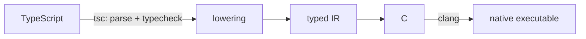

# Scriptc by Vercel: TypeScript-to-Native compiler, no JavaScript engine in binary

**Scriptc: Zero-runtime TypeScript.** scriptc compiles ordinary TypeScript into small, fast native executables — no Node, no V8, no JavaScript engine in the binary.
**Scriptc：零运行时 TypeScript。** scriptc 将普通的 TypeScript 编译为小巧、快速的原生可执行文件——无需 Node，无需 V8，二进制文件中不包含任何 JavaScript 引擎。

```bash
$ cat fib.ts
function fib(n: number): number {
  return n < 2 ? n : fib(n - 1) + fib(n - 2);
}
console.log(fib(30));

$ scriptc run fib.ts
832040

$ scriptc build fib.ts && ls -la fib
-rwxr-xr-x 178K fib # a self-contained native binary, ~2ms startup
```

No changes to your code. No annotations, no dialect — the same TypeScript you run on Node, type-checked by the real TypeScript compiler and compiled to native. What compiles behaves byte-for-byte like Node.
无需更改代码。无需注解，无需方言——这就是你在 Node 上运行的同一个 TypeScript，由真正的 TypeScript 编译器进行类型检查并编译为原生代码。编译后的程序行为与 Node 完全一致（字节级兼容）。

### Install
### 安装
```bash
$ npm install -g scriptc
```
Requires clang (preinstalled with Xcode Command Line Tools). macOS arm64 is the primary platform; Linux and Windows binaries build by cross-compilation, each verified by its own differential test lane.
需要 clang（随 Xcode 命令行工具预装）。macOS arm64 是主要平台；Linux 和 Windows 二进制文件通过交叉编译构建，并各自通过独立的差异测试通道进行验证。

### The idea: staticness you can see
### 核心理念：可见的静态性
Most TypeScript is far more static than the ecosystem assumes. scriptc decides, construct by construct, what can compile to native code — and tells you:
大多数 TypeScript 代码比生态系统所认为的要静态得多。scriptc 会逐个结构地判断哪些可以编译为原生代码，并告知你：

```bash
$ scriptc coverage app.ts
statements analyzed 4481
compile statically 4451 (99%)
blockers:
×2 functions with optional parameters as values SC1090
×1 Promise.reject SC2020
```

### Three tiers, always explicit:
### 三个层级，始终明确：
1. **Compiled statically** — native code, no engine. The default, and the only mode unless you opt out.
1. **静态编译** — 原生代码，无引擎。这是默认模式，也是除非你主动选择退出外的唯一模式。
2. **Runs dynamically (--dynamic)** — an embedded JavaScript engine (quickjs-ng, ~620KB) executes what can't be static: npm dependencies' shipped JS, any-typed code. Every value crossing back into static code is validated at runtime — a lying type throws a catchable TypeError instead of corrupting memory.
2. **动态运行 (--dynamic)** — 内嵌的 JavaScript 引擎 (quickjs-ng, ~620KB) 执行无法静态化的代码：npm 依赖中发布的 JS、any 类型代码。每个返回静态代码的值都会在运行时进行验证——错误的类型会抛出可捕获的 TypeError，而不是破坏内存。
3. **Rejected** — everything else fails with a specific error code, a code frame, and usually a rewrite hint. Nothing is ever silently miscompiled.
3. **拒绝** — 其他所有情况都会失败，并伴随特定的错误代码、代码片段以及通常的重写建议。绝不会出现静默编译错误的情况。

### What compiles
### 编译范围
The static surface covers the language and the standard library real programs use:
静态支持范围涵盖了真实程序所使用的语言特性和标准库：

* **The language** — classes with single inheritance and true dynamic dispatch, closures with JS capture semantics, generics (monomorphized), discriminated unions, async/await on stackful fibers, exceptions with finally, destructuring, spread, optional/default/rest parameters, getters/setters, iterators, template literals, regular expressions.
* **语言特性** — 单继承类与真正的动态分发、具有 JS 捕获语义的闭包、泛型（单态化）、可辨识联合类型、基于有栈协程的 async/await、带 finally 的异常处理、解构、展开、可选/默认/剩余参数、getter/setter、迭代器、模板字符串、正则表达式。
* **The standard library** — strings with UTF-16-exact semantics, arrays/Maps/Sets with JS-exact ordering and identity, JSON with runtime-validated casts, Math, typed arrays and Buffer, Error hierarchies.
* **标准库** — 具有 UTF-16 精确语义的字符串、具有 JS 精确顺序和标识的数组/Map/Set、带运行时验证转换的 JSON、Math、类型化数组与 Buffer、错误层级。
* **Node's API surface** — fs, path, process, child_process, os, crypto, url/URL, zlib, timers, and the server stack: net, http, https, tls, dgram, dns, fs.watch, readline. Real proxy servers compile.
* **Node API 表面** — fs, path, process, child_process, os, crypto, url/URL, zlib, 定时器，以及服务器栈：net, http, https, tls, dgram, dns, fs.watch, readline。真实的代理服务器可以编译。
* **fetch and the WHATWG web subset** — streams, Headers, AbortSignal over the same native net/TLS stack.
* **fetch 与 WHATWG Web 子集** — 基于相同原生 net/TLS 栈的 streams, Headers, AbortSignal。
* **npm dependencies (with --dynamic)** — packages resolve with Node's own algorithm, typecheck against their shipped .d.ts, and their JS is embedded into the binary at build time.
* **npm 依赖 (--dynamic 模式)** — 包通过 Node 的算法解析，根据其发布的 .d.ts 进行类型检查，其 JS 在构建时嵌入到二进制文件中。

### Correctness
### 正确性
Two enforcement mechanisms run on every change:
每次更改都会运行两种强制机制：
* **Differential testing** — every corpus program (800+ tests) runs under Node and as a native binary; stdout, stderr, and exit codes must match byte-for-byte.
* **差异测试** — 每个语料库程序（800+ 测试）都在 Node 和原生二进制文件下运行；stdout、stderr 和退出代码必须字节级匹配。
* **Memory-safety lane** — the entire corpus re-runs under AddressSanitizer with a reference-count audit; leaks and use-after-free are build failures.
* **内存安全通道** — 整个语料库在 AddressSanitizer 下重新运行并进行引用计数审计；内存泄漏和 use-after-free 会导致构建失败。

### Performance
### 性能
Measured on Apple M-series against Node, Go, Rust, and Zig:
在 Apple M 系列芯片上与 Node、Go、Rust 和 Zig 进行对比测量：

| Dimension | scriptc |
| :--- | :--- |
| **Startup** | ~2.4ms (Node: ~47ms) |
| **Binary size** | 170–200KB static, ~3MB with --dynamic |
| **Memory (RSS)** | 1–4MB typical (Node: 67–116MB) |

### Escape hatches
### 逃生舱
* **comptime(() => ...)** — runs TypeScript at build time and bakes the result into the binary as a literal.
* **comptime(() => ...)** — 在构建时运行 TypeScript，并将结果作为字面量烘焙到二进制文件中。
* **Native FFI (--ffi)** — binds signature-only TypeScript declarations to direct C ABI calls.
* **原生 FFI (--ffi)** — 将仅包含签名的 TypeScript 声明绑定到直接的 C ABI 调用。

### Architecture
### 架构
