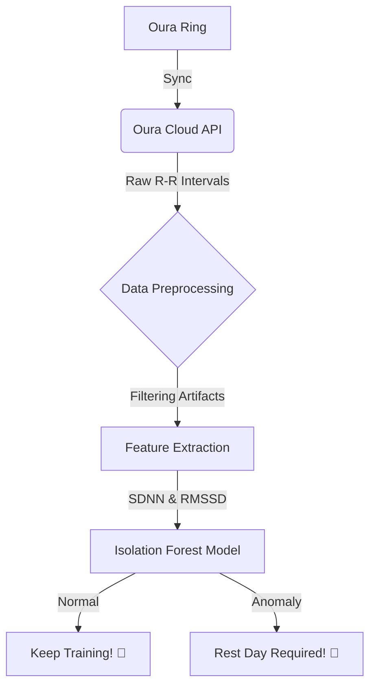

# How to Detect Overtraining Before It Hits: Analyzing HRV with Python and Isolation Forests 🏃‍♂️📉
# 如何在过度训练发生前进行检测：使用 Python 和孤立森林算法分析 HRV 🏃‍♂️📉

We’ve all been there: you're crushing your workouts, feeling like a beast, and then suddenly—bam. You can’t get out of bed, your resting heart rate is through the roof, and your motivation has evaporated. Welcome to Overtraining Syndrome (OTS).
我们都有过这样的经历：训练时状态神勇，感觉自己像头野兽，然后突然间——砰。你起不来床，静息心率飙升，动力也消失殆尽。欢迎来到过度训练综合征（OTS）的世界。

In the world of sports science, Heart Rate Variability (HRV) is the gold standard for tracking recovery. By analyzing the tiny fluctuations between heartbeats (R-R intervals), we can peek into our Autonomic Nervous System (ANS). Today, we’re going to build a Python-based pipeline to fetch data from the Oura Cloud API, calculate key HRV metrics like SDNN and RMSSD, and use an Isolation Forest model to detect when you're pushing a bit too hard. Whether you're a biohacker or a developer interested in wearable data analysis, this guide will show you how to turn raw health data into actionable recovery insights.
在运动科学领域，心率变异性（HRV）是追踪恢复情况的黄金标准。通过分析心跳之间的微小波动（R-R 间期），我们可以窥探自主神经系统（ANS）的状态。今天，我们将构建一个基于 Python 的流水线，从 Oura Cloud API 获取数据，计算 SDNN 和 RMSSD 等关键 HRV 指标，并使用孤立森林（Isolation Forest）模型来检测你是否训练过度。无论你是生物黑客还是对可穿戴设备数据分析感兴趣的开发者，本指南都将向你展示如何将原始健康数据转化为可操作的恢复建议。

### The Architecture: From Pulse to Prediction 🏗️
### 架构：从脉搏到预测 🏗️

Before we dive into the code, let's visualize how the data flows from your finger to our anomaly detection model.
在深入代码之前，让我们先可视化数据从你的指尖到异常检测模型的流动过程。



### Prerequisites 🛠️
### 前置条件 🛠️

To follow along, you’ll need a few tools in your tech_stack:
要跟随本教程，你需要准备以下技术栈工具：

*   **Python 3.9+**
*   **Scikit-learn**: For our machine learning magic. (用于机器学习魔法)
*   **SciPy/NumPy**: For the heavy math lifting. (用于繁重的数学计算)
*   **Oura Cloud API Access**: To get that sweet, sweet biometric data. (获取生物识别数据)

`pip install scikit-learn scipy pandas requests`

### Step 1: Fetching R-R Intervals from Oura 💍
### 第一步：从 Oura 获取 R-R 间期 💍

The Oura Ring records "R-R intervals" (the time between successive heartbeats in milliseconds) during sleep. This is much more granular than a simple "Heart Rate" average.
Oura Ring 在睡眠期间会记录“R-R 间期”（连续心跳之间的时间，以毫秒为单位）。这比简单的“平均心率”要精细得多。

```python
import requests
import pandas as pd

def fetch_oura_hrv_data(api_token, start_date, end_date):
    url = f'https://api.ouraring.com/v2/usercollection/heart_rate'
    headers = {'Authorization': f'Bearer {api_token}'}
    params = {'start_datetime': start_date, 'end_datetime': end_date}
    response = requests.get(url, headers=headers, params=params)
    # In a real scenario, you'd parse the specific 'interval' samples
    return response.json()
# Pro-tip: Ensure you handle rate limiting when dealing with Wearable APIs!
# 小贴士：处理可穿戴设备 API 时，请务必注意速率限制！
```

### Step 2: Calculating HRV Metrics (SDNN & RMSSD) 🔢
### 第二步：计算 HRV 指标 (SDNN & RMSSD) 🔢

Once we have the raw intervals, we need to transform them into features. Two time-domain indices are crucial:
获取原始间期后，我们需要将其转换为特征。两个时域指标至关重要：

*   **SDNN**: The standard deviation of N-N intervals. Reflects overall variability. (N-N 间期的标准差，反映整体变异性)
*   **RMSSD**: The root mean square of successive differences. This is the "go-to" for reflecting parasympathetic (recovery) activity. (连续差值的均方根，是反映副交感神经（恢复）活动的“首选”指标)

```python
import numpy as np
from scipy.stats import iqr

def calculate_hrv_metrics(rr_intervals):
    """ Calculates SDNN and RMSSD from a list of R-R intervals (ms). """
    # Remove outliers (ectopic beats) using IQR method
    q1, q3 = np.percentile(rr_intervals, [25, 75])
    diff = q3 - q1
    cleaned_rr = [x for x in rr_intervals if (q1 - 1.5*diff <= x <= q3 + 1.5*diff)]
    
    # SDNN
    sdnn = np.std(cleaned_rr)
    # RMSSD
    successive_diffs = np.diff(cleaned_rr)
    rmssd = np.sqrt(np.mean(successive_diffs**2))
    
    return {"sdnn": sdnn, "rmssd": rmssd}
```

### Step 3: Detecting Overtraining with Isolation Forest 🤖
### 第三步：使用孤立森林检测过度训练 🤖

Why Isolation Forest? Unlike traditional thresholds, Isolation Forest is an unsupervised learning algorithm that identifies anomalies by isolating observations. Since overtraining symptoms vary wildly between individuals, we want to find "outliers" in your personal recovery pattern.
为什么要用孤立森林？与传统的阈值法不同，孤立森林是一种无监督学习算法，通过隔离观测值来识别异常。由于过度训练的症状因人而异，我们需要在你的个人恢复模式中寻找“离群点”。

```python
from sklearn.ensemble import IsolationForest

# Assume 'df' contains columns ['sdnn', 'rmssd'] for the last 30 days
def detect_ots_risk(df):
    # We expect about 5% of days to be "anomalous" recovery days
    model = IsolationForest(contamination=0.05, random_state=42)
    # Fit the model on your historical HRV features
    df['anomaly_score'] = model.fit_predict(df[['sdnn', 'rmssd']])
    # -1 indicates an anomaly (Potential Overtraining)
    # 1 indicates normal behavior
    return df
```

### The "Official" Way: Advanced Patterns 🥑
### “官方”进阶模式 🥑

While this script is a great starting point for a "Learning in Public" project, production-grade health-tech applications require more robust signal processing (like Butterworth filters) and personalized baseline shifting. If you are looking for more production-ready examples and advanced architectural patterns for health data pipelines, I highly recommend checking out the engineering deep-dives at Wellally's Blog.
虽然这个脚本是“公开学习”项目的绝佳起点，但生产级的健康科技应用需要更稳健的信号处理（如巴特沃斯滤波器）和个性化的基准偏移。如果你正在寻找更具生产价值的示例和健康数据流水线的高级架构模式，我强烈建议查看 Wellally 博客的工程深度解析。

### Conclusion: Listen to the Data (and Your Body) 🧘‍♂️
### 结论：倾听数据（以及你的身体） 🧘‍♂️

By combining Oura Cloud API data with Scikit-learn, we've built a primitive "Check Engine" light for your body. The next time your RMSSD drops significantly below your 30-day baseline, and your Isolation Forest model flags an anomaly, it might be time to swap that heavy deadlift session for some light yoga.
通过结合 Oura Cloud API 数据和 Scikit-learn，我们为你的身体构建了一个原始的“发动机故障”指示灯。下次当你的 RMSSD 显著低于 30 天基准线，且孤立森林模型标记出异常时，也许是时候把那场沉重的硬拉训练换成轻量瑜伽了。

**Key Takeaways:**
*   HRV is a window into your nervous system. (HRV 是观察神经系统的窗口)
*   RMSSD is your best friend for recovery tracking. (RMSSD 是你追踪恢复情况的最佳伙伴)
*   Machine Learning helps filter out the noise of daily fluctuations. (机器学习有助于过滤日常波动的噪音)