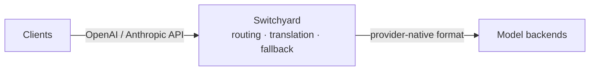

# NVIDIA-NeMo / Switchyard

Switchyard is a Rust proxy and library for LLM traffic. It routes requests across providers, translates between OpenAI and Anthropic APIs, records operational metrics, and provides typed, composable routing algorithms.
Switchyard 是一个用于大语言模型（LLM）流量的 Rust 代理和库。它可以在不同提供商之间路由请求，在 OpenAI 和 Anthropic API 之间进行转换，记录操作指标，并提供类型化、可组合的路由算法。

Why Switchyard? Point a coding agent such as Claude Code or Codex at an open-source model. Switchyard translates between the OpenAI Chat, Anthropic Messages, and OpenAI Responses formats, so the agent keeps speaking its native API while the request is served by vLLM, NVIDIA NIM, Ollama, or any OpenAI-compatible endpoint. The same proxy can spread traffic across several models for A/B benchmarking, apply signal-driven stage routing, or run a custom algorithm you write yourself.
为什么要使用 Switchyard？你可以将 Claude Code 或 Codex 等编码代理指向开源模型。Switchyard 可以在 OpenAI Chat、Anthropic Messages 和 OpenAI Responses 格式之间进行转换，因此代理可以继续使用其原生 API，而请求则由 vLLM、NVIDIA NIM、Ollama 或任何兼容 OpenAI 的端点提供服务。同一个代理可以将流量分配到多个模型进行 A/B 测试、应用信号驱动的阶段路由，或运行你自己编写的自定义算法。

### Features
### 功能特性

*   **Protocol Translation:** convert between OpenAI Chat, Anthropic Messages, and OpenAI Responses formats.
    **协议转换：** 在 OpenAI Chat、Anthropic Messages 和 OpenAI Responses 格式之间进行转换。
*   **Multi-Backend Routing:** random routing, LLM-as-classifier routing, signal-driven stage-router, or your own algorithm.
    **多后端路由：** 支持随机路由、LLM 分类器路由、信号驱动的阶段路由，或你自定义的算法。
*   **Operational Metrics:** Prometheus metrics cover requests, errors, latency, tokens, and routing overhead.
    **操作指标：** 提供 Prometheus 指标，涵盖请求、错误、延迟、Token 使用量和路由开销。

### Maturity
### 成熟度

Switchyard is pre-alpha software that is evolving rapidly. The API and algorithms are expected to change significantly before we reach v1.0.
Switchyard 目前处于 pre-alpha 阶段，正在快速演进。在达到 v1.0 版本之前，API 和算法预计会有重大变更。

**Warning:** Experimental software. Not for production use.
**警告：** 实验性软件，请勿用于生产环境。

---

### Quick Start
### 快速开始

*   Choose the **launcher** path to run Claude Code, Codex CLI, or OpenClaw through Switchyard.
    选择 **launcher（启动器）** 路径，通过 Switchyard 运行 Claude Code、Codex CLI 或 OpenClaw。
*   Choose the **server** path to run Switchyard as a standalone proxy.
    选择 **server（服务器）** 路径，将 Switchyard 作为独立代理运行。
*   Choose the **library** path to embed routing in your own Rust application.
    选择 **library（库）** 路径，将路由功能嵌入到你自己的 Rust 应用程序中。

#### Launcher Path
#### Launcher 路径

Install uv if it is not already available, then install the published Switchyard tool:
如果尚未安装 uv，请先安装，然后安装已发布的 Switchyard 工具：

```bash
curl -LsSf https://astral.sh/uv/install.sh | sh
source "$HOME/.local/bin/env"
uv tool install --python 3.10 "nemo-switchyard[cli]"
```

The coding agent you launch must also be installed and on your PATH. This does not install the standalone switchyard-server binary; use the Server Path for that.
你启动的编码代理也必须已安装并位于你的 PATH 环境变量中。此操作不会安装独立的 switchyard-server 二进制文件；如需安装，请使用 Server 路径。

Set an OpenRouter key and launch against the packaged deployment:
设置 OpenRouter 密钥并针对打包的部署进行启动：

```bash
export OPENROUTER_API_KEY="your-openrouter-key"
switchyard launch claude --model switchyard
switchyard launch codex --model switchyard
switchyard launch openclaw --model switchyard
```

To use your own native TOML deployment, pass its route ID and configuration:
若要使用你自己的原生 TOML 部署，请传入其路由 ID 和配置：

```bash
switchyard launch claude --model my-route --config routes.toml
```

#### Server Path
#### Server 路径

Use this path to install and run the standalone Rust proxy. Install Rust with Cargo, then install the published binary:
使用此路径安装并运行独立的 Rust 代理。使用 Cargo 安装 Rust，然后安装已发布的二进制文件：

```bash
cargo install --locked switchyard-server
switchyard-server --help
```

Cargo builds the release binary and installs it into `~/.cargo/bin` by default. Create `routes.toml` using the Getting Started guide, then validate it and start the server:
Cargo 会构建发布版二进制文件并默认将其安装到 `~/.cargo/bin`。使用“入门指南”创建 `routes.toml`，然后验证并启动服务器：

```bash
export OPENROUTER_API_KEY="your-openrouter-key"
switchyard-server --config routes.toml --dry-run
switchyard-server --config routes.toml --host 127.0.0.1 --port 4000
```

Verify the proxy in another terminal:
在另一个终端中验证代理：

```bash
curl http://localhost:4000/health
```

For a complete configuration and a test request, follow [Getting Started](https://github.com/NVIDIA-NeMo/Switchyard/blob/main/docs/getting-started.md).
有关完整配置和测试请求，请参考 [Getting Started（入门指南）](https://github.com/NVIDIA-NeMo/Switchyard/blob/main/docs/getting-started.md)。

#### Library Path
#### Library 路径

`switchyard-libsy` embeds the routing algorithms in your own Rust application. It never calls a model itself: an algorithm decides which target to use and hands every model call back to you, so it drops into an existing proxy, gateway, or agent runtime without owning an HTTP stack. Pair it with `switchyard-llm-client` when you want the calls made for you.
`switchyard-libsy` 将路由算法嵌入到你自己的 Rust 应用程序中。它本身不会调用模型：算法决定使用哪个目标，并将每个模型调用交还给你，因此它可以直接集成到现有的代理、网关或代理运行时中，而无需接管 HTTP 栈。如果你希望自动执行调用，请将其与 `switchyard-llm-client` 配合使用。

```toml
[dependencies]
switchyard-libsy = { git = "https://github.com/NVIDIA-NeMo/Switchyard.git" }
switchyard-protocol = { git = "https://github.com/NVIDIA-NeMo/Switchyard.git" }
```

See [Getting Started](https://github.com/NVIDIA-NeMo/Switchyard/blob/main/docs/getting-started.md) for setup and the algorithm list, or the `switchyard-libsy` crate docs.
请参阅 [Getting Started](https://github.com/NVIDIA-NeMo/Switchyard/blob/main/docs/getting-started.md) 获取设置和算法列表，或查看 `switchyard-libsy` crate 文档。

---

### Routing Strategies
### 路由策略

| Strategy | Use it when | Route type |
| :--- | :--- | :--- |
| **LLM Classifier** | Request content should decide whether a turn needs the weak or strong tier. | `llm_classifier` |
| **Stage Router** | Signals already in the conversation, such as tool results and errors, should route most turns without an extra model call. | `stage_router` |
| **Escalation Router** | Every turn runs on the weak tier first, and a judge reads that answer to decide whether to send the same request to the strong tier. | `llm_classifier` with mode = "escalation" |
| **Random** | You need a fixed traffic split for A/B tests, baselines, or cost experiments. | `random` |

| 策略 | 使用场景 | 路由类型 |
| :--- | :--- | :--- |
| **LLM 分类器** | 需要根据请求内容决定当前轮次使用弱模型还是强模型。 | `llm_classifier` |
| **阶段路由** | 对话中已有的信号（如工具结果和错误）应能路由大多数轮次，无需额外的模型调用。 | `stage_router` |
| **升级路由** | 每一轮先在弱模型上运行，由判断器读取答案以决定是否将同一请求发送到强模型。 | `llm_classifier` (mode = "escalation") |
| **随机** | 需要固定的流量分配来进行 A/B 测试、基准测试或成本实验。 | `random` |

A passthrough route registers one target under one model ID with no routing decision. See the [Routing Overview](https://github.com/NVIDIA-NeMo/Switchyard/blob/main/docs/routing-overview.md) for the common route shape and self-hosted targets.
直通路由（Passthrough route）在单个模型 ID 下注册一个目标，不进行任何路由决策。有关通用路由结构和自托管目标的详细信息，请参阅 [Routing Overview（路由概述）](https://github.com/NVIDIA-NeMo/Switchyard/blob/main/docs/routing-overview.md)。

---

### Architecture
### 架构



Clients keep their native OpenAI or Anthropic API format. Switchyard picks a configured backend, forwards the request in that backend's own format, and translates the response back into the shape the client expects. The server accepts OpenAI Chat Completions, OpenAI Responses, and Anthropic Messages. Each configured LLM client selects one upstream format.
客户端保持其原生的 OpenAI 或 Anthropic API 格式。Switchyard 选择一个已配置的后端，以该后端自身的格式转发请求，并将响应转换回客户端期望的格式。服务器接受 OpenAI Chat Completions、OpenAI Responses 和 Anthropic Messages。每个配置好的 LLM 客户端都会选择一种上游格式。

---

### Documentation
### 文档

*   [Getting Started](https://github.com/NVIDIA-NeMo/Switchyard/blob/main/docs/getting-started.md): complete launcher and standalone server walkthroughs
    [入门指南](https://github.com/NVIDIA-NeMo/Switchyard/blob/main/docs/getting-started.md)：完整的启动器和独立服务器操作指南
*   [Core Concepts](https://github.com/NVIDIA-NeMo/Switchyard/blob/main/docs/core-concepts.md): LLM clients, targets, routes, model IDs, and routing algorithms
    [核心概念](https://github.com/NVIDIA-NeMo/Switchyard/blob/main/docs/core-concepts.md)：LLM 客户端、目标、路由、模型 ID 和路由算法
*   [Routing Overview](https://github.com/NVIDIA-NeMo/Switchyard/blob/main/docs/routing-overview.md): choose and configure a routing algorithm
    [路由概述](https://github.com/NVIDIA-NeMo/Switchyard/blob/main/docs/routing-overview.md)：选择并配置路由算法
*   `switchyard-server`: server configuration, routing algorithms, and metrics
    `switchyard-server`：服务器配置、路由算法和指标
*   `switchyard-libsy`: embed routing algorithms in a Rust application
    `switchyard-libsy`：在 Rust 应用程序中嵌入路由算法
*   `switchyard-protocol`: provider-neutral request, response, and streaming types
    `switchyard-protocol`：提供商中立的请求、响应和流式传输类型
*   `switchyard-translation`: request, response, and stream translation
    `switchyard-translation`：请求、响应和流转换

### Community
### 社区

*   [Issues](https://github.com/NVIDIA-NeMo/Switchyard/issues): GitHub Issues
    [问题反馈](https://github.com/NVIDIA-NeMo/Switchyard/issues)：GitHub Issues
*   [Code of Conduct](https://github.com/NVIDIA-NeMo/Switchyard/blob/main/CODE_OF_CONDUCT.md): Code of Conduct
    [行为准则](https://github.com/NVIDIA-NeMo/Switchyard/blob/main/CODE_OF_CONDUCT.md)：行为准则

### License
### 许可证

Apache 2.0 License. Copyright NVIDIA Corporation.
Apache 2.0 许可证。版权所有 NVIDIA Corporation。