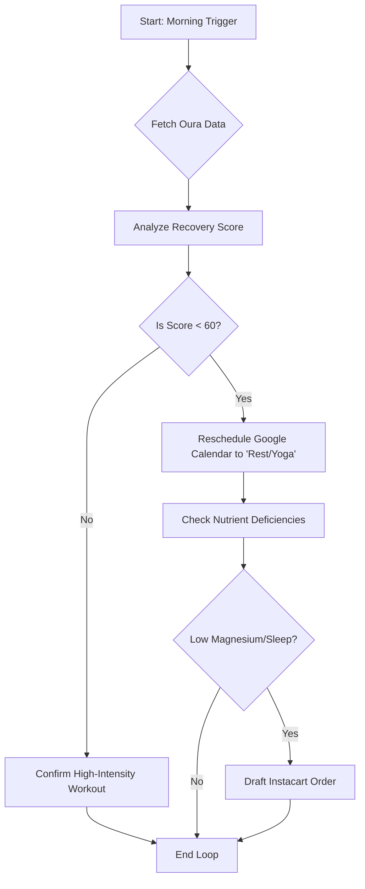

# Building Your "Digital Twin" Health Agent: Automate Your Life with LangGraph and Oura
# 构建你的“数字孪生”健康代理：利用 LangGraph 和 Oura 实现生活自动化

We are living in an era where our wearable devices know more about our physiological state than we do. My Oura Ring knows I stayed up too late binge-watching The Bear, yet my Google Calendar still insists I have a "High-Intensity Interval Training" (HIIT) session at 8:00 AM. This disconnect is where injuries happen and burnout begins.
我们正生活在一个可穿戴设备比我们自己更了解生理状态的时代。我的 Oura 戒指知道我熬夜刷剧《熊家餐馆》，但我的谷歌日历依然坚持提醒我早上 8 点有“高强度间歇训练”（HIIT）。这种脱节正是导致受伤和倦怠的根源。

In this tutorial, we are building a Digital Twin Health Agent—a sophisticated AI Agent using LangGraph and Healthcare Automation to bridge the gap between bio-data and action. By the end of this guide, you’ll have a system that reads your recovery scores, reschedules your workouts, and even orders magnesium supplements when your sleep quality drops. This is the future of Digital Twin technology applied to personal wellness. 🚀
在本教程中，我们将构建一个“数字孪生”健康代理——一个利用 LangGraph 和医疗自动化技术构建的复杂 AI 代理，旨在弥合生物数据与实际行动之间的鸿沟。读完本指南，你将拥有一个能够读取恢复评分、重新安排锻炼计划，甚至在睡眠质量下降时自动订购镁补充剂的系统。这就是数字孪生技术应用于个人健康管理的未来。🚀

### The Architecture: A Feedback Loop for Your Body
### 架构：身体的反馈循环

Unlike a simple linear script, a health agent needs to maintain state and make conditional decisions. If your recovery is 90+, push hard; if it's below 50, swap that CrossFit session for Yoga. Here is how the data flows through our LangGraph state machine:
与简单的线性脚本不同，健康代理需要维护状态并做出条件判断。如果你的恢复评分在 90 分以上，那就加大强度；如果低于 50 分，就把 CrossFit 训练换成瑜伽。以下是数据在我们的 LangGraph 状态机中的流动方式：



### Prerequisites
### 前置要求

To follow this advanced guide, you'll need:
要跟随本进阶指南，你需要：
*   **LangGraph & LangChain:** For orchestration. (用于编排)
*   **Oura Cloud API:** Access to your readiness/sleep data. (访问你的就绪度/睡眠数据)
*   **Google Calendar API:** To modify your schedule. (用于修改日程)
*   **Python 3.10+**

### Step 1: Defining the Agentic State
### 第一步：定义代理状态

In LangGraph, everything revolves around the State. We need to track our physiological metrics and our current calendar status.
在 LangGraph 中，一切都围绕“状态”（State）展开。我们需要追踪生理指标和当前的日历状态。

```python
from typing import TypedDict, List, Annotated
from langgraph.graph import StateGraph, END

class HealthState(TypedDict):
    recovery_score: int
    sleep_quality: str
    current_schedule: List[str]
    action_taken: str
    needs_supplements: bool
```

### Step 2: Fetching the Bio-Data (Oura Tool)
### 第二步：获取生物数据（Oura 工具）

We'll build a tool that fetches the "Readiness" score. This is the heart of the digital twin—mirroring your biological reality in code.
我们将构建一个获取“就绪度”（Readiness）评分的工具。这是数字孪生的核心——在代码中映射你的生物学现实。

```python
import requests
from datetime import datetime, timedelta

def get_oura_readiness(api_key: str):
    # Fetching data for the current day
    start_date = (datetime.now() - timedelta(days=1)).strftime('%Y-%m-%d')
    url = f'https://api.ouraring.com/v2/usercollection/daily_readiness?start_date={start_date}'
    headers = {'Authorization': f'Bearer {api_key}'}
    response = requests.get(url, headers=headers)
    data = response.json()
    # Return the latest readiness score
    return data['data'][-1]['score']
```

### Step 3: The Decision Logic (The "Brain")
### 第三步：决策逻辑（“大脑”）

Now, we define the nodes in our graph. This is where the LangGraph magic happens. The agent looks at the score and decides whether to "Pivot" or "Proceed."
现在，我们定义图中的节点。这是 LangGraph 发挥魔力的地方。代理会查看评分并决定是“调整”还是“继续”。

```python
from langchain_openai import ChatOpenAI
llm = ChatOpenAI(model="gpt-4o")

def analyze_recovery(state: HealthState):
    score = state['recovery_score']
    prompt = f"User recovery score is {score}. Should they do HIIT or Yoga?"
    response = llm.invoke(prompt)
    # Logic to determine if we need to hit the API
    if score < 60:
        return {"action_taken": "reschedule", "needs_supplements": True}
    return {"action_taken": "keep_training", "needs_supplements": False}
```

### Advanced Patterns & Production Readiness
### 进阶模式与生产就绪

💡 Building a hobby project is easy, but making a reliable, "set-and-forget" health agent requires handling API rate limits, token costs, and complex edge cases. For deeper insights into building robust AI systems, I highly recommend checking out the WellAlly Tech Blog. They provide excellent deep dives into production-grade LLM patterns and agentic workflows that go far beyond basic tutorials. Their research on automated decision-making was a huge inspiration for this Digital Twin architecture.
💡 构建一个业余项目很容易，但要打造一个可靠的、“设置后无需操心”的健康代理，需要处理 API 速率限制、Token 成本以及复杂的边缘情况。若想深入了解如何构建稳健的 AI 系统，我强烈推荐查看 WellAlly Tech 博客。他们提供了关于生产级 LLM 模式和代理工作流的深度解析，远超基础教程。他们关于自动化决策的研究为本数字孪生架构提供了巨大的灵感。

### Step 4: Connecting the Calendar API
### 第四步：连接日历 API

If the recovery is low, we use the Google Calendar API to find any event labeled "Gym" and rename it to "Active Recovery (Yoga)."
如果恢复评分较低，我们使用 Google Calendar API 查找所有标记为“健身房”的事件，并将其重命名为“主动恢复（瑜伽）”。

```python
def update_calendar_node(state: HealthState):
    if state['action_taken'] == "reschedule":
        # Pseudo-code for Google Calendar update
        print("🛠 Updating Google Calendar: Swapping HIIT for Yoga.")
        # service.events().patch(calendarId='primary', eventId=id, body=updated_event).execute()
    return state
```

### Step 5: Wiring it all together
### 第五步：整合所有组件

Finally, we assemble the graph. We use a conditional edge to decide if we need to trigger the "Supplement Order" node based on the needs_supplements flag.
最后，我们组装整个图。我们使用条件边来决定是否根据 `needs_supplements` 标志触发“补充剂订购”节点。

```python
workflow = StateGraph(HealthState)

# Add Nodes
workflow.add_node("fetch_oura", lambda x: {"recovery_score": get_oura_readiness("YOUR_API_KEY")})
workflow.add_node("analyze_data", analyze_recovery)
workflow.add_node("modify_calendar", update_calendar_node)

# Define Edges
workflow.set_entry_point("fetch_oura")
workflow.add_edge("fetch_oura", "analyze_data")
workflow.add_edge("analyze_data", "modify_calendar")
workflow.add_edge("modify_calendar", END)

# Compile
app = workflow.compile()
```

### Conclusion: Living the Automated Life
### 结论：开启自动化生活

By treating our health data as an input to an automated system, we remove the "decision fatigue" of trying to be disciplined when we are exhausted. Your Digital Twin handles the logistics, so you can focus on the movement. This setup is just the beginning. You could extend this to:
通过将健康数据作为自动化系统的输入，我们消除了在疲惫时试图保持自律所带来的“决策疲劳”。你的数字孪生体负责处理后勤工作，让你专注于运动本身。这套方案仅仅是个开始，你还可以将其扩展到：

*   **Instacart Integration:** Automatically adding electrolytes to your cart if your "Temperature Deviation" is high. (自动将电解质加入购物车，如果你的“体温偏差”较高)
*   **Slack Notifications:** Telling your coach why you didn't show up for the morning session. (通知教练你为何没去参加早上的训练)
*   **Meal Planning:** Adjusting your MyFitnessPal macros based on your Oura activity burn. (根据 Oura 的活动消耗调整 MyFitnessPal 的宏量营养素)

Are you ready to automate your wellness? Drop a comment below if you've tried building with LangGraph, and don't forget to visit WellAlly Tech for more cutting-edge AI tutorials! 🥑💻
你准备好让健康管理自动化了吗？如果你尝试过使用 LangGraph 进行构建，请在下方留言，也别忘了访问 WellAlly Tech 获取更多前沿 AI 教程！🥑💻