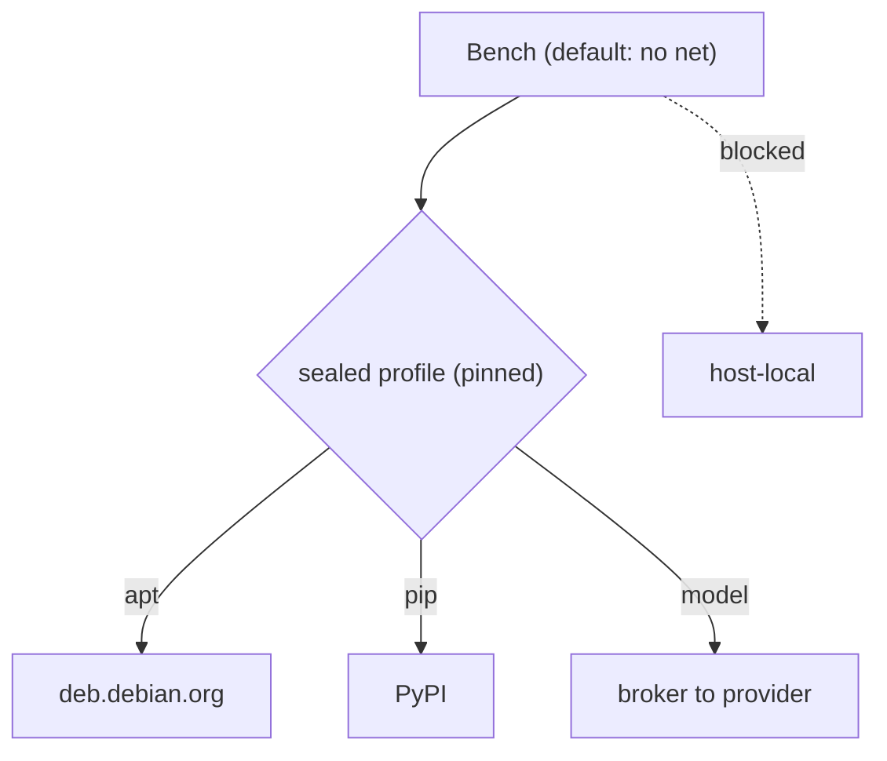
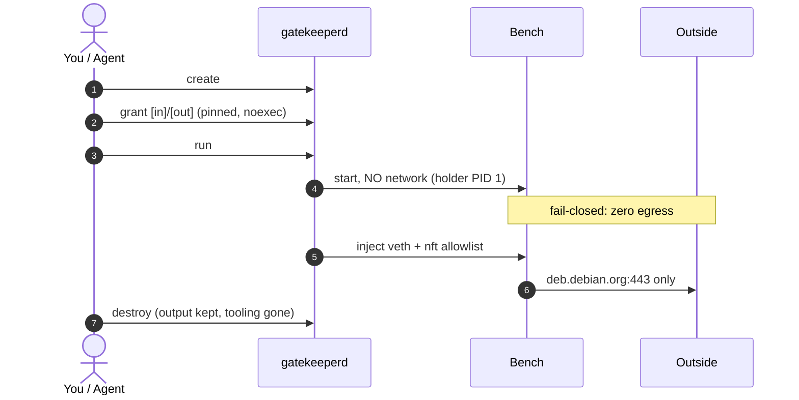

# ShrekOS in two diagrams: giving an agent exactly one folder and one hostname
# 两张图看懂 ShrekOS：如何只给代理分配一个文件夹和一个主机名

This is a companion map to my Building ShrekOS series. If you have read Part 2, you have the argument already. This post is the picture: how an untrusted workload gets to do real work while reaching almost nothing.
这是我“构建 ShrekOS”系列文章的配套导览图。如果你已经读过第二部分，那么你已经了解了其中的论点。这篇文章则是直观的图解：一个不受信任的工作负载如何在几乎无法访问任何资源的情况下完成实际工作。

The whole thing runs on one idea. An agent, or any untrusted job, runs inside a Bench: a disposable box that starts with no files and no network, and is handed capabilities one at a time, narrowly, and revocably.
整个系统的核心理念只有一个。代理（或任何不受信任的任务）运行在一个“Bench”（工作台）中：这是一个一次性的容器，启动时没有任何文件和网络访问权限，所有能力都是逐一、精确且可撤销地授予的。

Four rules:
四项原则：

1. **Deny by default.** A Bench starts with nothing. No files it can see, no network it can reach. Everything below is an exception I opened on purpose.
1. **默认拒绝。** Bench 启动时一无所有。它看不到任何文件，也无法访问任何网络。以下所有内容都是我特意开启的例外。

2. **A grant is a pinned object, not a path.** When I grant a directory, the system pins the actual inode and relocates it into the Bench mounted noexec. A swapped symlink cannot redirect it, and files cannot be directly executed from the granted host mount.
2. **授权对象是固定的 inode，而非路径。** 当我授予某个目录权限时，系统会锁定实际的 inode，并将其挂载到 Bench 中，且设置为 `noexec`（禁止执行）。被替换的符号链接无法重定向它，且挂载的文件无法直接执行。

3. **Egress is a sealed, pinned destination, never "the internet."** A Bench that needs the network gets a named profile, say the Debian package host. The supervisor resolves and pins it through sealed policy; the Bench itself gets no DNS access and everything else stays dropped.
3. **出口是封闭且固定的目标，绝非“互联网”。** 需要网络的 Bench 会获得一个命名配置文件，例如 Debian 软件包主机。监督程序通过封闭策略解析并锁定该目标；Bench 本身无法进行 DNS 解析，其他所有流量均被丢弃。

4. **A Bench never gets both egress and a secret.** A box that can read a token and reach arbitrary network destinations can mail that token to a stranger. So credentialed calls go through a broker outside the Bench, which holds the credential, makes the call, and hands back only the result.
4. **Bench 不会同时拥有出口权限和密钥。** 一个既能读取令牌又能访问任意网络目标的容器，可能会将令牌发送给陌生人。因此，需要凭证的调用必须通过 Bench 外部的代理（broker）进行，由该代理持有凭证、发起调用，并仅将结果返回给 Bench。

### Egress, at a glance
### 出口流量概览

### One Bench, start to finish
### 单个 Bench 的完整生命周期

The last line is the point of the whole design. The box is thrown away, but the file it produced stays. Disposability protects the host's future; it does nothing about the present blast radius, which is why the grants above matter more than the teardown.
最后一行是整个设计的核心所在。容器被销毁，但它产生的文件得以保留。这种“一次性”特性保护了主机的未来安全；它虽然无法改变当前的爆炸半径，但这正是为什么上述授权机制比销毁机制更为重要的原因。

### The deep-dives
### 深度解析

The mechanics behind each rule get their own parts in the series: why a Bench at all (Part 2), how a single grant is made attacker-proof, and how the one egress door stays honest. This post is just the map to hang them on.
每一条规则背后的机制都在本系列文章中有详细拆解：为什么要使用 Bench（第二部分）、如何确保单个授权免受攻击，以及如何确保唯一的出口通道保持合规。这篇文章仅仅是用来梳理这些内容的导览图。