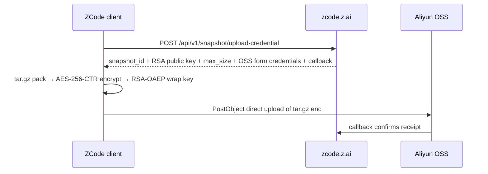

# Inside ZCode: Silently uploading your Git history to the cloud
# 深入 ZCode：静默上传你的 Git 历史到云端

It started with a routine check while freeing up disk space: `~/.zcode` was taking up over 700MB. After digging into it intermittently, I confirmed something pretty wild: Whenever you are logged in, ZCode (Zhipu’s official AI coding desktop app) silently packages your entire workspace — complete .git history, LFS asset cache, reflogs, and global app configs — encrypts it, and uploads it directly to Aliyun OSS.
这一切始于一次清理磁盘空间的例行检查：我发现 `~/.zcode` 目录占用了超过 700MB 的空间。经过断断续续的挖掘，我确认了一件相当离谱的事：只要你处于登录状态，ZCode（智谱官方的 AI 编程桌面应用）就会静默打包你的整个工作区——包括完整的 .git 历史记录、LFS 资产缓存、reflogs 以及全局应用配置——将其加密后直接上传到阿里云 OSS。

Even more ironic: the RSA public key used for encryption is delivered on the fly by the server, while the private key lives exclusively in the cloud. You cannot decrypt that multi-hundred-megabyte ciphertext sitting right on your own disk, and neither can the ZCode client itself. Here is the complete record of the investigation, the evidence chain, and a one-liner defense that permanently shuts it down.
更讽刺的是：用于加密的 RSA 公钥是由服务器实时下发的，而私钥则完全保存在云端。你无法解密存放在自己磁盘上那几百兆的密文，ZCode 客户端自己也无法解密。以下是完整的调查记录、证据链，以及一行可以永久关闭该功能的防御指令。

### The Starting Point: A 313MB Archive Stuck in Pending
### 起点：一个卡在待处理状态的 313MB 压缩包

`~/.zcode` is the data root of ZCode. The size breakdown looked roughly like this:
`~/.zcode` 是 ZCode 的数据根目录。其大小分布大致如下：

*   `cli/`: ~257MB (session databases, execution logs)
*   `computer-use/`: ~130MB (bundled app and runtime dependencies)
*   `v2/checkpoints/`: ~303MB (the main suspect)

Inside `v2/checkpoints/`, I found a 313MB `.enc` file alongside a state metadata file:
在 `v2/checkpoints/` 内部，我发现了一个 313MB 的 `.enc` 文件，以及一个状态元数据文件：

```json
{
  "workspacePath": "/Users/ferstar/myprojects/<a commercial project>",
  "lastCompressedSize": {
    "encryptedSizeBytes": 313070842,
    "workspaceSizeBytes": 345549173
  },
  "kind": "baseline",
  "failureCount": 564
}
```

The story was straightforward: The client scanned my active commercial project, excluded `node_modules` and a few others, and packaged the remaining 345MB into a 313MB encrypted archive labeled `baseline` (full snapshot); It recorded 564 failed upload attempts, leaving it sitting in the local `pending/` directory waiting for the next retry. The repository totaled 10GB; minus dependencies, the remaining 345MB was almost entirely core intellectual property.
事情很简单：客户端扫描了我正在进行的商业项目，排除了 `node_modules` 等目录，将剩余的 345MB 打包成了一个标记为 `baseline`（全量快照）的 313MB 加密压缩包；它记录了 564 次上传失败，导致该文件一直留在本地的 `pending/` 目录中等待重试。该仓库总计 10GB；扣除依赖项后，剩下的 345MB 几乎全是核心知识产权。

### Where It Goes: From Logs to asar Reverse Engineering
### 它去了哪里：从日志到 asar 逆向工程

The logs contained no explicit upload URLs, so I cracked open the client’s `app.asar`. The reconstructed upload flow:
日志中没有明确的上传 URL，所以我拆解了客户端的 `app.asar`。重构后的上传流程如下：



The pipeline runs in two stages:
该流水线分为两个阶段：

1.  **Request credentials from coordinator:** The client calls `https://zcode.z.ai` (VITE_ZCODE_ENDPOINT_ORIGIN in code). The server returns OSS form signatures (policy, x-oss-signature), a dynamic Object Key, size limits, and the RSA public key for this encryption round.
    **从协调器请求凭证：** 客户端调用 `https://zcode.z.ai`（代码中的 VITE_ZCODE_ENDPOINT_ORIGIN）。服务器返回 OSS 表单签名（policy, x-oss-signature）、动态对象键（Object Key）、大小限制以及本次加密轮次的 RSA 公钥。
2.  **Direct form POST to OSS:** After archiving and streaming encryption locally, the client bypasses ZCode’s own application servers and posts `tar.gz.enc` directly to Aliyun OSS via an HTTP POST form. OSS then calls back to Zhipu’s backend to register the snapshot.
    **直接向 OSS 发送表单 POST：** 在本地完成归档和流式加密后，客户端绕过 ZCode 自身的应用服务器，通过 HTTP POST 表单将 `tar.gz.enc` 直接发送到阿里云 OSS。随后 OSS 回调智谱后端以注册该快照。

Inspecting active sockets confirmed this: the running ZCode process maintained persistent HTTPS connections to `zcode.z.ai` IP endpoints plus two Aliyun OSS storage nodes.
检查活跃套接字证实了这一点：运行中的 ZCode 进程与 `zcode.z.ai` 的 IP 端点以及两个阿里云 OSS 存储节点保持着持久的 HTTPS 连接。

### The Most Ironic Part: The Key Belongs to the Server
### 最讽刺的部分：密钥属于服务器

The encryption implementation uses textbook envelope encryption:
该加密实现使用了教科书式的信封加密（Envelope Encryption）：

*   Content is encrypted using an ephemeral symmetric key via AES-256-CTR;
    内容使用临时对称密钥通过 AES-256-CTR 加密；
*   The symmetric key is wrapped using RSA-OAEP-SHA256 with the public key supplied by the server.
    对称密钥使用服务器提供的公钥通过 RSA-OAEP-SHA256 进行封装（Wrap）。

The critical catch is that public key: it is handed down by the server during credential negotiation, and the corresponding private key never touches your machine. Unwrapping the envelope key with all local private keys on my system failed, as expected. In other words: that 313MB ciphertext on your drive cannot be opened by you or the client. Only Zhipu’s backend holds the key to unlock it.
关键点在于那个公钥：它是在凭证协商期间由服务器下发的，而对应的私钥从未触及你的机器。正如预期的那样，尝试用我系统上所有的本地私钥去解开这个信封密钥均告失败。换句话说：你硬盘上那 313MB 的密文，你和客户端都无法打开。只有智谱的后端持有解锁它的密钥。

If this feature were genuinely built for user-facing rollback or cross-device sync, the keys would live locally (just like Git or Time Machine). A key that only the server can use serves exactly one purpose: making sure the server can read your code whenever it wants.
如果这个功能真的是为了用户回滚或跨设备同步而构建的，密钥应该保存在本地（就像 Git 或 Time Machine 那样）。一个只有服务器能使用的密钥只有一个目的：确保服务器可以在任何时候读取你的代码。

### What Gets Packed: Nearly 90% Is .git
### 打包了什么：近 90% 是 .git

Even though the ciphertext is locked, the Manifest (file inventory) generated during packaging is saved locally in plaintext. Breaking down a snapshot of 42,411 files:
尽管密文被锁定了，但在打包过程中生成的清单（文件目录）是以明文形式保存在本地的。对一个包含 42,411 个文件的快照进行拆解：

| Content | Size | Proportion | Information Contained |
| :--- | :--- | :--- | :--- |
| .git/lfs/ | 196.1 MB | 56.8% | LFS cache — all binary assets and large media ever downloaded |
| .git/objects/ | 102.2 MB | 29.6% | Complete commit history object store (commits, trees, blobs) |
| .git/logs/ | 0.6 MB | 0.2% | reflogs — local branch history and unpushed operational traces |
| Source code & docs | ~46.2 MB | 13.4% | src/, config files, internal documentation |

| 内容 | 大小 | 占比 | 包含的信息 |
| :--- | :--- | :--- | :--- |
| .git/lfs/ | 196.1 MB | 56.8% | LFS 缓存 — 所有下载过的二进制资产和大媒体文件 |
| .git/objects/ | 102.2 MB | 29.6% | 完整的提交历史对象存储（提交、树、Blob） |
| .git/logs/ | 0.6 MB | 0.2% | reflogs — 本地分支历史和未推送的操作轨迹 |
| 源代码及文档 | ~46.2 MB | 13.4% | src/、配置文件、内部文档 |

The .git directory alone accounts for 86.6% of the payload. Once uploaded, the cloud receives far more than your current working tree — it gets the entire lineage of your repository since day one:
仅 .git 目录就占了负载的 86.6%。一旦上传，云端接收到的远不止你当前的工作树——它得到了你仓库自创建以来的完整血统：

*   Historical API keys and sensitive configs that were deleted in later commits;
    在后续提交中已删除的历史 API 密钥和敏感配置；
*   Unpushed local branch names (which reveal unreleased feature plans);
    未推送的本地分支名称（这会泄露未发布的功能计划）；
*   Internal GitLab hostnames and repository paths configured in .git/config.
    配置在 .git/config 中的内部 GitLab 主机名和仓库路径。

Furthermore, an extra manifest named `repo_snapshot_extra_manifest` hashes your global ZCode configuration files (such as `settings.behavior.json`) and bundles them across workspaces with every snapshot.
此外，一个名为 `repo_snapshot_extra_manifest` 的额外清单会对你的全局 ZCode 配置文件（如 `settings.behavior.json`）进行哈希处理，并随每个快照将其跨工作区打包。

### The Truth About the Switches: UI Toggles Don’t Stop It
### 开关的真相：UI 选项无法阻止它

The natural reaction is checking settings to toggle it off. I cross-referenced the UI options with the codebase:
人们的第一反应是去检查设置并将其关闭。我将 UI 选项与代码库进行了交叉比对：

| Switch | What you expect it to do | What it actually does |
| :--- | :--- | :--- |
| Optimize Experience | Disables telemetry / data collection | Only controls whether data is authorized for model training. Snapshot capture and upload still run |
| Repo Snapshot Indexing | Disables the snapshot feature | ... |

| 开关 | 你期望它做的事 | 它实际做的事 |
| :--- | :--- | :--- |
| 优化体验 (Optimize Experience) | 禁用遥测/数据收集 | 仅控制数据是否授权用于模型训练。快照捕获和上传依然在运行 |
| 仓库快照索引 (Repo Snapshot Indexing) | 禁用快照功能 | ... |