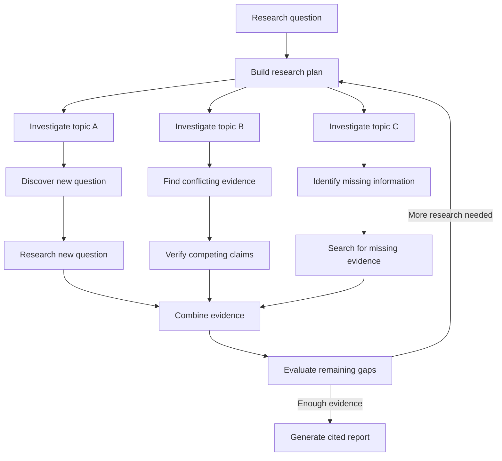

# Self-Hosted Deep Research Systems: 12 Tools Compared
# 自托管深度研究系统：12 款工具对比

Deep Research has become its own category of software, not just a model pointed at a search box. This article compares twelve self-hosted systems and the research architectures behind them. The line that actually matters is not whether a product ships a button labelled Deep Research, but what happens after the first round of retrieval. A genuine system notices that its plan was incomplete, chases a newly discovered lead, weighs conflicting sources, and only then writes the report.
“深度研究”（Deep Research）已成为一个独立的软件类别，而不仅仅是连接到搜索框的模型。本文对比了十二个自托管系统及其背后的研究架构。真正重要的界限不在于产品是否提供了一个标有“深度研究”的按钮，而在于第一轮检索之后发生了什么。一个真正的系统能够意识到其计划的不完整性，追踪新发现的线索，权衡相互冲突的来源，最后才撰写报告。

Below I compare twelve open-source and self-hosted projects that implement this loop in different ways: recursive research trees, planner-plus-subagent designs, evidence-gap loops, perspective-driven question generation, and model-driven agentic search. For each one I cover the architecture, local-LLM support, RAG or private-document access, deployment complexity, and the license you actually inherit if you self-host. Where a system is also a full product (Open WebUI, Vane), I keep the focus on how it researches and link out to the dedicated guide for installation and configuration.
下面我将对比十二个以不同方式实现这一循环的开源和自托管项目：递归研究树、规划器加子代理设计、证据缺口循环、视角驱动的问题生成以及模型驱动的代理搜索。对于每一个项目，我都涵盖了其架构、本地大模型支持、RAG 或私有文档访问、部署复杂性以及自托管时所继承的许可证。如果某个系统同时是一个完整的产品（如 Open WebUI、Vane），我将重点关注其研究方式，并提供安装和配置的专用指南链接。

Deep Research is one of the more demanding applied workloads in the AI Systems - it stresses retrieval, planning, and multi-step orchestration all at once, rather than any single layer in isolation.
深度研究是 AI 系统中要求较高的应用工作负载之一——它同时强调检索、规划和多步编排，而不是孤立地强调某一层。

### What Is Deep Research?
### 什么是深度研究？

A conventional AI web-search workflow is mostly linear. Even when several searches are performed, the model usually just creates related queries, retrieves documents, and summarizes what it finds:
传统的 AI 网络搜索工作流大多是线性的。即使执行了多次搜索，模型通常也只是创建相关查询、检索文档并总结其发现的内容：

Question | Search | Retrieve pages | Summarize | Answer
问题 | 搜索 | 检索页面 | 总结 | 回答

Deep Research adds a layer: the research process itself becomes adaptive. After the first pass, the system can branch, re-check, and keep going until the evidence is sufficient.
深度研究增加了一个层面：研究过程本身变得具有自适应性。在第一轮检索后，系统可以进行分支、重新检查并持续运行，直到证据充足为止。

The distinction matters. A system that searches five times is not necessarily performing Deep Research; a stronger system starts with one question, discovers an unexpected implementation detail, opens a new research branch around it, compares primary and secondary sources, and revises its original assumptions.
这种区别很重要。一个搜索五次的系统并不一定是在进行“深度研究”；一个更强大的系统会从一个问题开始，发现意想不到的实现细节，围绕它开启一个新的研究分支，比较一手和二手来源，并修正其最初的假设。

There is no single Deep Research architecture. Current self-hosted implementations generally fall into five groups:
深度研究没有单一的架构。目前的自托管实现通常分为五类：
1. Recursive research trees. (递归研究树)
2. Planner and subagent architectures. (规划器和子代理架构)
3. Evidence-gap-driven research loops. (证据缺口驱动的研究循环)
4. Perspective and question-driven research. (视角和问题驱动的研究)
5. Agentic iterative search. (代理迭代搜索)

The first four provide more explicit research structure. The fifth can still perform surprisingly deep investigation when paired with a strong reasoning and tool-calling model, but much of the strategy is delegated to the model itself. The evidence-gap loop in particular is a system-level cousin of the self-reflective retrieval used in Self-RAG-style pipelines — deciding whether to retrieve again, judging relevance, and critiquing the draft before answering.
前四种提供了更明确的研究结构。第五种在配合强大的推理和工具调用模型时，仍然可以进行出人意料的深入调查，但大部分策略都委托给了模型本身。特别是证据缺口循环，它是 Self-RAG 风格流水线中使用的“自反思检索”的系统级对应物——即在回答之前决定是否再次检索、判断相关性并批判性地审查草稿。

### Self-Hosted Deep Research Systems Compared
### 自托管深度研究系统对比

The table below summarizes the major systems. "Recursive depth" does not mean that multiple web searches are possible; it means the system has some mechanism for deriving additional investigation from intermediate findings.
下表总结了主要系统。“递归深度”并不意味着可以进行多次网络搜索；它意味着系统具有某种机制，可以从中间发现中推导出额外的调查。

*(Note: Due to formatting constraints, the table content is summarized below)*
*(注：由于格式限制，下表内容摘要如下)*

| System | Local LLM | Web Research | Private Docs / RAG | Planning | Recursive Depth |
| :--- | :--- | :--- | :--- | :--- | :--- |
| **GPT Researcher** | Yes | Yes | Yes | Yes | Excellent |
| **Unsloth Studio** | Yes | Yes | Yes | Very good | Excellent |
| **Local Deep Research** | Yes | Yes | Yes | Excellent | Excellent |
| **STORM / Co-STORM** | Yes | Yes | Custom | Yes | Very good |
| **DeerFlow** | Yes | Yes | Yes | Excellent | Excellent |
| **Onyx** | Yes | Yes | Excellent | Yes | Excellent |
| **Open Deep Research** | Yes | Yes | Via tools | Excellent | Excellent |
| **Open WebUI** | Yes | Yes | Excellent | Model driven | Good |
| **Khoj** | Yes | Yes | Excellent | Yes | Moderate |
| **SurfSense** | Yes | Yes | Excellent | Yes | Good |
| **Vane** | Yes | Yes | File search | Limited | Limited |
| **Deep Research (lukeswade)** | Yes | Yes | Library | Yes | Excellent |

One point stands out: there is no direct relationship between UI sophistication and research depth. Open WebUI and Vane provide polished interfaces, while GPT Researcher and STORM are centered more on the research algorithm. Conversely, Onyx and Unsloth Studio try to provide both a strong user experience and a substantial research workflow.
有一点很突出：UI 的复杂程度与研究深度之间没有直接关系。Open WebUI 和 Vane 提供了精美的界面，而 GPT Researcher 和 STORM 则更侧重于研究算法。相反，Onyx 和 Unsloth Studio 试图同时提供强大的用户体验和实质性的研究工作流。

### Deep Research Architectures
### 深度研究架构

Before comparing individual products, it is useful to understand the architectural differences.
在对比各个产品之前，了解架构差异很有帮助。

| Style | Representative Systems | Main Idea |
| :--- | :--- | :--- |
| **Recursive research tree** | GPT Researcher | Explicit breadth and depth generate new research branches |
| **Planner plus subagents** | DeerFlow, Open Deep Research | Planner decomposes work and independent agents investigate pieces |
| **Evidence-gap driven** | Unsloth Studio, Local Deep Research, lukeswade | Iterative refinement based on missing information |

| 风格 | 代表系统 | 核心理念 |
| :--- | :--- | :--- |
| **递归研究树** | GPT Researcher | 通过明确的广度和深度生成新的研究分支 |
| **规划器加子代理** | DeerFlow, Open Deep Research | 规划器分解工作，独立代理调查各个部分 |
| **证据缺口驱动** | Unsloth Studio, Local Deep Research, lukeswade | 基于缺失信息进行迭代优化 |